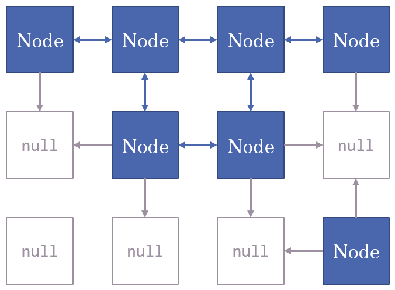

# Introduction

Le projet choisi pour le cours d'algorithme concerne les labyrinthes.

L'application sera en mesure de générer des labyrinthes aléatoires. Une fois le labyrinthe créer, le logiciel va le résoudre en empruntant le chemin le plus court.

Un labyrinthe est caractérisé par une seule et unique entrée, de même pour la sortie.

# Fonctionnement

Le labyrinthe est réalisé en deux étapes :

- Génération du labyrinthe en lui-même
- Résolution du labyrinthe en passant par le chemin le plus court

Le labyrinthe généré prend la forme d'un cercle ou d'un donut.

# Structure de données

Un graph composé de nœuds est utilisé.

Chaque nœud peut avoir au plus quatres nœuds voisins, représentant les chemins possibles au sein du labyrinthe.

Les nœuds sont également disposés dans une grille, il est ainsi possible d'accédée à un nœuds a partir de sa position X et Y dans la grille, ou a partir d'un nœud voisin.

# Algorithmes utilisés

Les algorithmes employés sont les suivants :

-  Pour la génération, l'algorithme de [recherche en profondeur](https://en.wikipedia.org/wiki/Maze_generation_algorithm#Randomized_depth-first_search), également nommé "retour-récursif"
-  Pour la résolution du labyrinthe, l'algorithme de recherche en largeur est utilisé

# Génération du labyrinthe

Le point de départ de l'algorithme est situé tout en haut du labyrinthe, celui-ci va utiliser une pile pour stocker l'historique des nœuds.

L'algo va sélectionner une case voisine libre au hasard et y ajouter un nouveau nœud (qui sera également ajouter à l'historique). Si aucune case voisine n'est libre, l'algo va revenir en arrière (en enlevant le dernier nœud de l'historique). Si l'historique est vide, l'algo se termine.

# Résolution du labyrinthe

Pour la résolution du labyrinthe, une recherche en profondeur iterative est utilisée, une file est donc utilisé pour mémorisé le chemin parcouru actuel

Cette recherche en profondeur a quelques variantes :

* Au lieu de mettre un simple booléen à vrai sur un nœud pour indiquer qu'il a été rencontré, une référence vers le nœud qu'il l'a rencontré est mis à la place (avec `null` signifiant que le nœud n'a pas été rencontré) ;
* Lorsque le nœud visité correspond au nœud final (sortie du labyrinthe), l'algoritme s'arrête.
