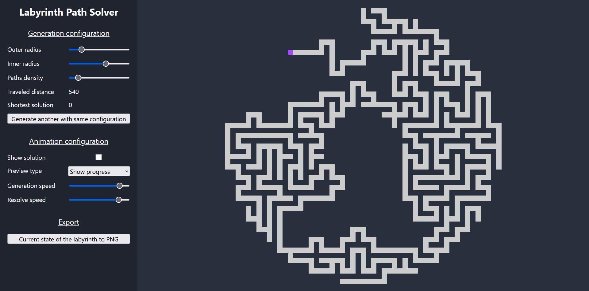
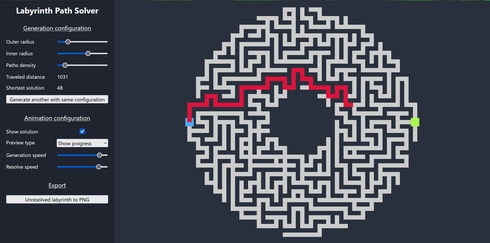
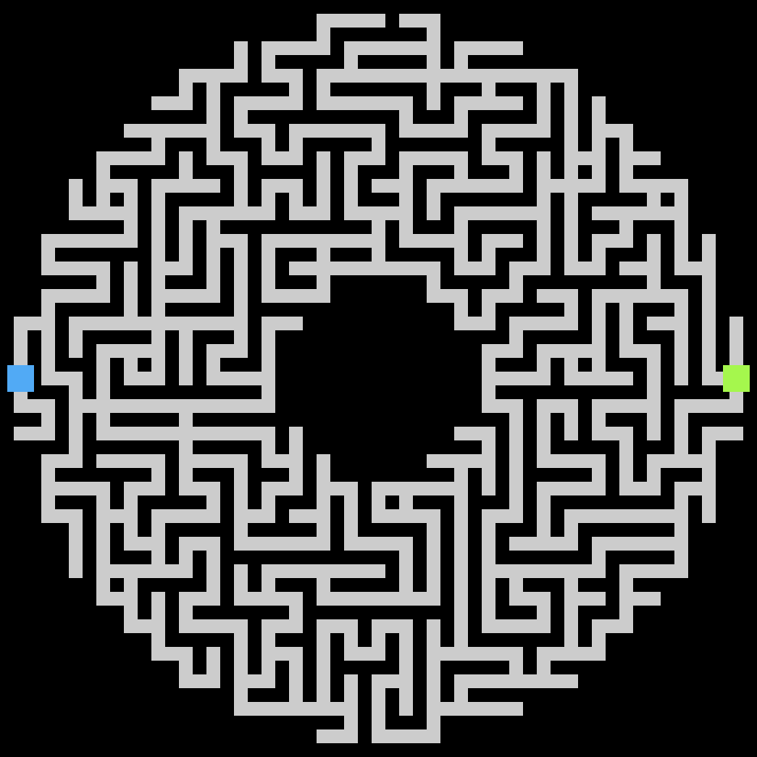
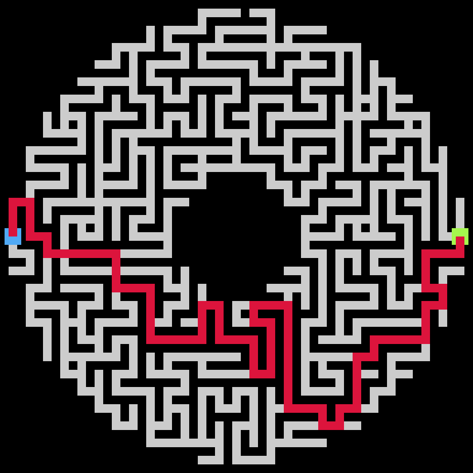
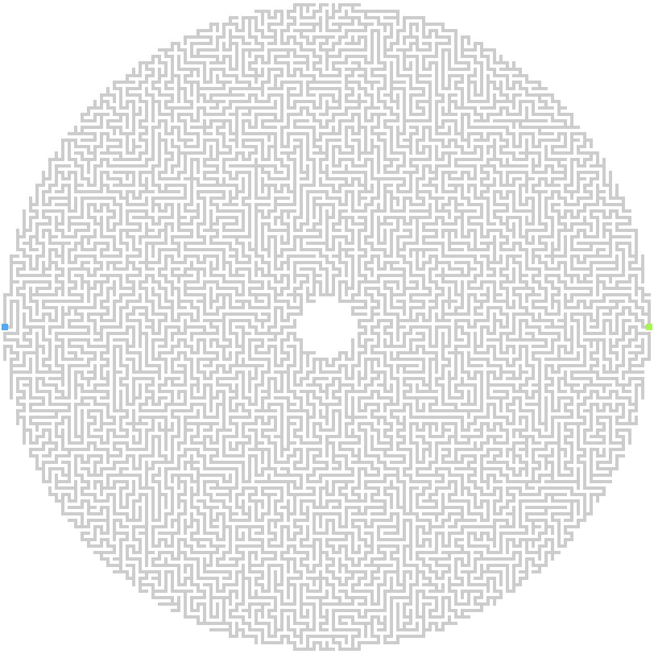
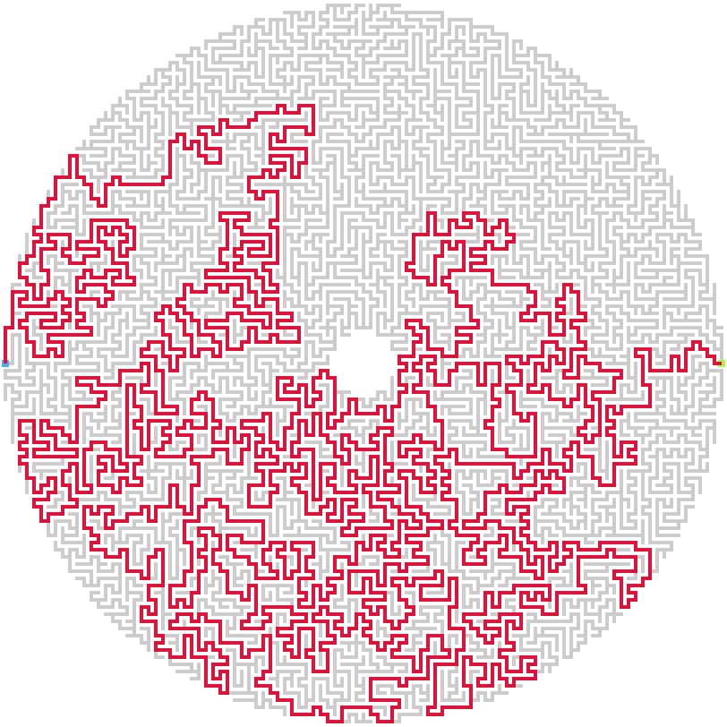

# Introduction

Le projet choisi pour le cours d'algorithme concerne les labyrinthes.

L'application sera en mesure de générer des labyrinthes aléatoires. Une fois le labyrinthe créer, le logiciel va le résoudre en empruntant le chemin le plus court.

Un labyrinthe est caractérisé par une seule et unique entrée, de même pour la sortie.

# Fonctionnement

Le labyrinthe est réalisé en deux étapes :

* Génération du labyrinthe en lui-même ;
* Résolution du labyrinthe en passant par le chemin le plus court.

Le labyrinthe généré prend la forme d'un cercle ou d'un donut.

# Structure de données

Un graphe composé de nœuds est utilisé.

Chaque nœud peut avoir au plus quatre nœuds voisins, représentant les chemins possibles au sein du labyrinthe.

Les nœuds sont également disposés dans une grille, il est ainsi possible d'accédée à un nœud à partir de sa position X et Y dans la grille, ou à partir d'un nœud voisin.

# Algorithmes utilisés

Les algorithmes employés sont les suivants :

* Pour la génération, l'algorithme de [recherche en profondeur](https://en.wikipedia.org/wiki/Maze_generation_algorithm#Randomized_depth-first_search), également nommé "retour-récursif" ;
* Pour la résolution du labyrinthe, l'algorithme de recherche en largeur est utilisé.

# Génération du labyrinthe

Le point de départ de l'algorithme est situé tout en haut du labyrinthe, celui-ci va utiliser une pile pour stocker l'historique des nœuds.

L'algo va sélectionner une case voisine libre au hasard et y ajouter un nouveau nœud (qui sera également ajouté à l'historique). Si aucune case voisine n'est libre, l'algo va revenir en arrière ("backtrack"), en enlevant le dernier nœud de l'historique. Si l'historique est vide, l'algo se termine.

# Résolution du labyrinthe

Pour la résolution du labyrinthe, une recherche en profondeur itérative est utilisée, une file est donc utilisée pour mémoriser le chemin parcouru actuel

Cette recherche en profondeur a quelques variantes :

* Au lieu de mettre un simple booléen à vrai sur un nœud pour indiquer qu'il a été rencontré, une référence vers le nœud qu'il l'a rencontré est mise à la place (avec `null` signifiant que le nœud n'a pas été rencontré) ;
* Lorsque le nœud visité correspond au nœud final (sortie du labyrinthe), l'algorithme s'arrête.

Le point de départ de la résolution du labyrinthe est situé tout à gauche, il n'est donc pas obligé le même que le point de départ utilisé lors de la génération.

Visuellement, un chemin rouge représente le tracé du chemin le plus court. Lors de la progression de celle-ci, une interpolation est faite entre deux nœuds pour rendre la progression fluide.

# Page web

La page web est composée en deux parties :

* À gauche : interface du labyrinthe ;
* À droite : représentation visuelle du labyrinthe.

## Partie interface

Partie génération :

* Rayon extérieur du labyrinthe ;
* Rayon intérieur du laby, permet de donner une forme de "donut" au labyrinthe ;
* Densité des chemins : permets d'ajouter des chemins alternatifs pour la résolution, si le slider est tout à gauche, un chemin sera possible pour atteindre la sortie du labyrinthe ;
* Générer un autre labyrinthe avec la même configuration ;
* Distance parcourue par le carré violet lors de la génération ;
* Solution la plus courte : distance parcourue par la jauge rouge.

Partie résolution :

* Montrer la solution : affiche un tracé passant par le chemin le plus court pour résoudre le labyrinthe ;
* Type de preview : choix entre afficher la progression de la génération et résolution, ou entre afficher le tout instantanément ;
* Vitesse de génération : si le slider est tout à gauche, la partie "backtrack" de la génération et le carré violet ne seront pas représentés ;
* Vitesse de résolution.

Partie exportation :

* Exporter une image PNG du labyrinthe dans son état actuel (bouton visible lorsque la génération est en cours) ;
* Exporter une image PNG du labyrinthe sans sa résolution (bouton visible lorsque la génération est terminée) ;
* Exporter une image PNG du labyrinthe comprenant sa résolution (bouton visible lors la génération est terminée et que la résolution n'est pas en cours).

## Partie visuelle du labyrinthe

* En forme de cercle ou de donut ;
* Chemin en gris clair sur fond bleu foncé ;
* Départ du labyrinthe (utilisé pour la résolution) en bleu clair ;
* Arrivé du labyrinthe (utilisé pour la résolution) en vert clair ;
* Génération du labyrinthe : représenté par un carré violet ;
* Résolution du labyrinthe : représenté par une jauge rouge.

# Difficultés rencontrées

Nous avons dû réfléchir à la manière de représenter une génération et une résolution "non instantanée", pour cela, nous avons utilisé les mots-clés `async` et `await` en JavaScript avec des `Promise`, cela permet d'avoir une attente en plein milieu du code sans geler l'interface utilisateur, il a fallu prendre en compte les cas où l'utilisateur modifie une entrée durant la génération ou durant la résolution, tel qu'interrompre l'action en cours.

# Résultats

L'algorithme de génération passe exactement par `2 * (nombre de nœuds) - 1` cases. Cela est dû au fait que chaque nœud est exploré une fois lors de la génération, puis une autre fois lors du "backtrack", à l'exception du nœud le plus "loin" du point de départ (d'où le `- 1`).

Plus le nombre de chemins supplémentaires est élevé, plus le chemin le plus court sera visuellement direct (ligne allant de gauche à droite si le labyrinthe n'a pas la forme d'un donut), alors que dans le cas où le nombre de chemins supplémentaires est à zéro, le chemin le plus court va généralement faire plein d'allers-retours.

## Captures d'écran

Génération du labyrinthe :

Résolution du labyrinthe :

Exportation d'une image PNG (labyrinthe non-résolu) :

Exportation d'une image PNG (labyrinthe résolu) :

# Conclusion

Le labyrinthe est représenté par un graphe composé de nœuds, ces nœuds sont également accessibles via une grille.

La génération utilise une pile pour l'exploration et le "backtrack", alors que la résolution utilise une file pour effectuer une recherche en largeur.

Il est possible de générer un labyrinthe de taille variable en forme de cercle ou de donut, et il est également possible de choisir la vitesse de génération et de résolution.

La génération et la résolution du labyrinthe se font de manière asynchrone.

Un nombre plus élevé de chemins supplémentaires donnera un chemin plus court pour la résolution.

# Challenge

Voici un labyrinthe de taille maximale avec 1 seul chemin possible. Parviendrez-vous à le résoudre ?

 
  
Vous abandonnez ? La solution ce trouve ici !

   

